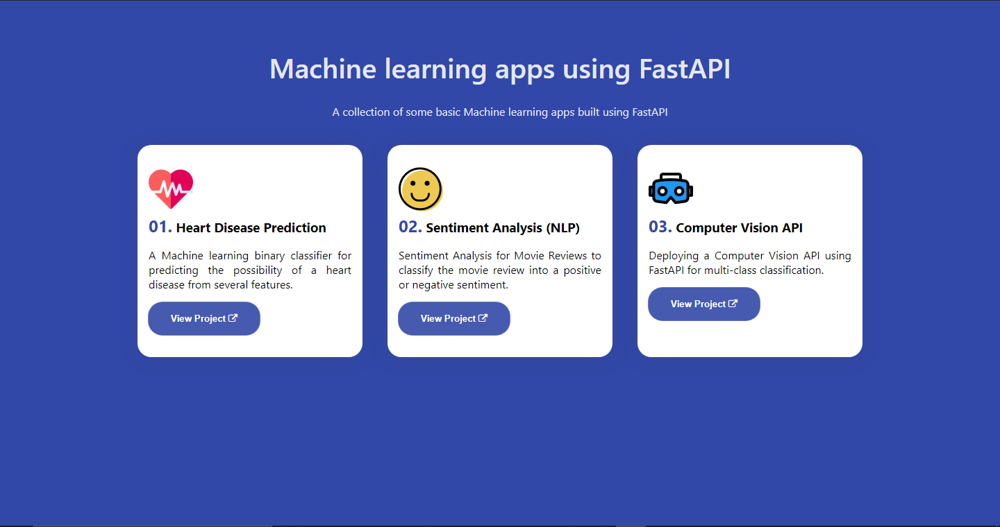

## FastAPI Machine learning apps 

A collection of basic machine learning apps built with FastAPI and python best practices.

### Running the app 

```
$ cd app
```

- Install dependencies
```
$ pip install -r requirements.txt
```

- Run the app in your local server using uvicorn
```
$ python main.py
```

### Testing the app 

Navigate to http://localhost:5000 in your browser :- 



Navigate to http://localhost:5000/docs in your browser to see the docs for each app.

## Heroku deployment 

The app is currently publicly available on https://fastapi-ml-apps.herokuapp.com 

Check it out and leave a star if you love it !

